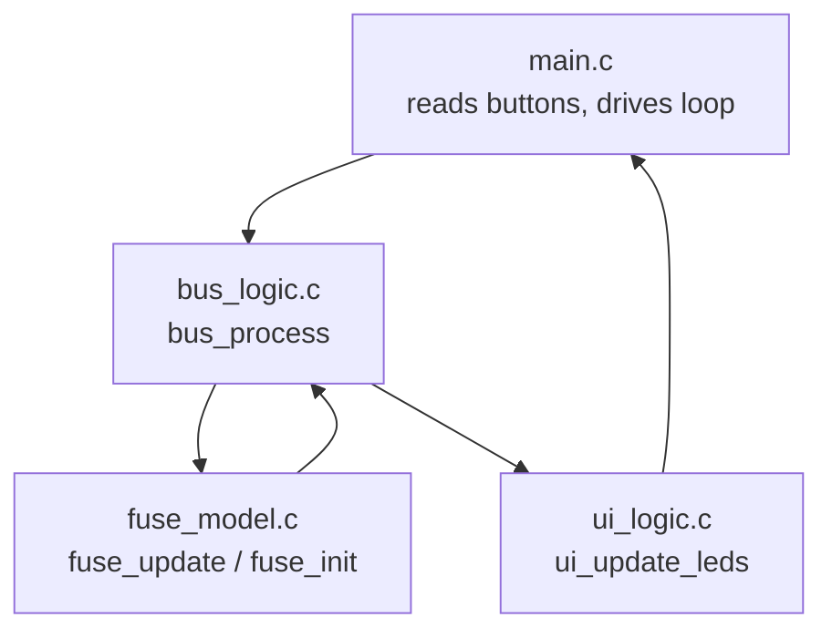
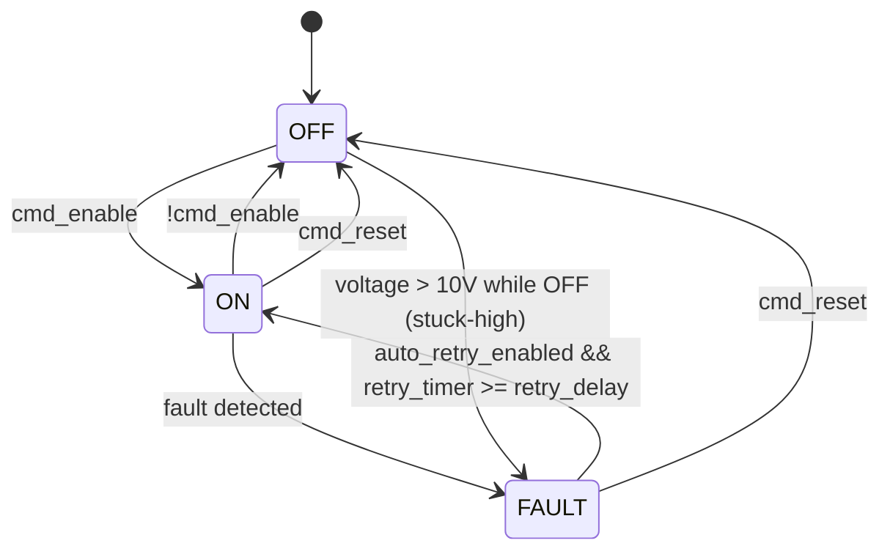

# ⚡ Smart Electronic Fuse (e-Fuse)


A smart electronic fuse (e-fuse) controller for DC circuit protection, implemented in C for Arduino. Detects overcurrent, thermal (I²T) overload, short-to-ground, short-to-battery, open-load, and stuck-high faults, with configurable auto-retry and RGB LED status indication.

The core protection logic is fully hardware-independent and unit-tested — it can be built and verified with plain `gcc`, no board required.

---

## ✨ Features

- **Overcurrent protection** — hard current limit trip
- **I²T (thermal) protection** — accumulates `I² × dt` over time and trips on sustained overload, with cooldown decay when current drops
- **Short-to-Ground (S2G) detection** — low output voltage with excess current
- **Short-to-Battery (S2B) detection** — abnormally high output voltage with excess current
- **Open-load detection** — flags near-zero current while the fuse is commanded ON
- **Stuck-high detection** — flags unexpected voltage present while the fuse is commanded OFF
- **Auto-retry** — configurable delay before automatically attempting recovery from a fault
- **RGB LED status indication** — distinct color per fault type
- **Hardware-independent core** — `fuse_model.c` / `bus_logic.c` have zero Arduino dependencies and are fully unit-tested

---

## 🧠 Architecture



- **`fuse_model.c`** — the safety-critical state machine: fault detection, I²T accumulation, auto-retry timing
- **`bus_logic.c`** — translates high-level commands (enable/reset/load profile) into inputs for the fuse model, and reports status back
- **`ui_logic.c`** — maps fault state to RGB LED color
- **`main.c`** — Arduino entry point, reads physical buttons, drives the loop every 100 ms

---

## 🔄 State Machine



---

## 🚦 Fault Types & LED Colors

| Fault              | LED Color | Trigger Condition                                      |
|---------------------|-----------|----------------------------------------------------------|
| `NONE`              | 🟢 Green  | No fault, normal operation                               |
| `OVERCURRENT`       | 🔴 Red    | Current exceeds hard limit, or I²T accumulator exceeds threshold |
| `S2G`               | 🔵 Blue   | Voltage < 1V while current > 50% of nominal               |
| `S2B`               | 🟣 Purple | Voltage > 16V while current > 50% of nominal               |
| `OPEN_LOAD`         | ⚪ White  | Current < 0.1A while fuse is ON                            |
| `STUCK_HIGH`        | 🟡 Yellow | Voltage > 10V while fuse is commanded OFF                  |

---

## 🔌 Hardware / Wiring

| Signal        | Arduino Pin | Mode           |
|----------------|-------------|----------------|
| LED Red        | D2          | OUTPUT         |
| LED Green      | D3          | OUTPUT         |
| LED Blue       | D4          | OUTPUT         |
| Enable button  | D10         | INPUT_PULLUP   |
| Reset button   | D11         | INPUT_PULLUP   |
| Normal load    | D12         | INPUT_PULLUP   |
| Heavy load     | D13         | INPUT_PULLUP   |
| Short (S2G)    | D14         | INPUT_PULLUP   |

Buttons are active-low (pull-up), so they trigger when pulled to GND.

> 📸 **Add your own build photos here** — a picture of the wired breadboard/board and a short clip of the LED changing color per fault makes this section far more convincing than the table above.

---

## 🚀 Getting Started (Arduino)

**Prerequisites:** Arduino IDE (or PlatformIO), an Arduino-compatible board, an RGB LED, 5 push buttons.

```bash
git clone https://github.com/Ovi-Wan/smart-fuse.git
cd smart-fuse
```

1. Open the project folder in the Arduino IDE.
2. Wire the LED and buttons according to the pinout table above.
3. Select your board and port.
4. Upload `main.c` (rename to `.ino` if required by your IDE) to the board.
5. Press the enable button, then switch load profiles to see the fuse react to normal load, heavy load, and a simulated short-to-ground.

---

## 🧪 Running Unit Tests (no hardware needed)

The core logic (`fuse_model.c`, `bus_logic.c`) has no Arduino dependency and compiles standalone:

```bash
gcc fuse_model.c bus_logic.c test_fuse.c -o test_fuse
./test_fuse
```

Expected output: all tests pass, covering normal operation, every fault type, auto-retry recovery, and reset behavior.

There's also a lightweight interactive CLI to manually exercise the state machine without any hardware:

```bash
gcc fuse_model.c bus_logic.c menu.c -o menu
./menu
```

Press `e` to enable, `0`/`1`/`2` to change load profile, `r` to reset, `h` for the menu.

---

## 📁 Project Structure

```
smart-fuse/
├── fuse_model.h / fuse_model.c   # core protection state machine (hardware-independent)
├── bus_logic.h  / bus_logic.c    # command/status translation layer
├── ui_logic.h   / ui_logic.c     # LED status mapping
├── main.c                        # Arduino entry point
├── test_fuse.c                   # unit test suite
├── menu.c                        # interactive CLI simulator
└── README.md
```

---

## 🛣️ Roadmap

- [ ] Separate `OVERCURRENT` (hard limit) from `I2T_OVERLOAD` as distinct fault types
- [ ] Persist fault history/log (last N faults with timestamps)
- [ ] Real ADC/current-sensor integration (`read_current_sensor`, `read_voltage_adc`)
- [ ] CAN bus interface for automotive-style integration
- [ ] CI pipeline running the unit tests on every push

---

## 📄 License

MIT — see [LICENSE](LICENSE) for details.

## 🤝 Author

Built by **[OVI-WAN]** — Informatics student, interested in embedded systems and automotive software.

[LinkedIn](https://linkedin.com/in/https://www.linkedin.com/in/nicolae-ovidiu-hambasan-691954331/) · [GitHub](https://github.com/Ovi-Wan)
